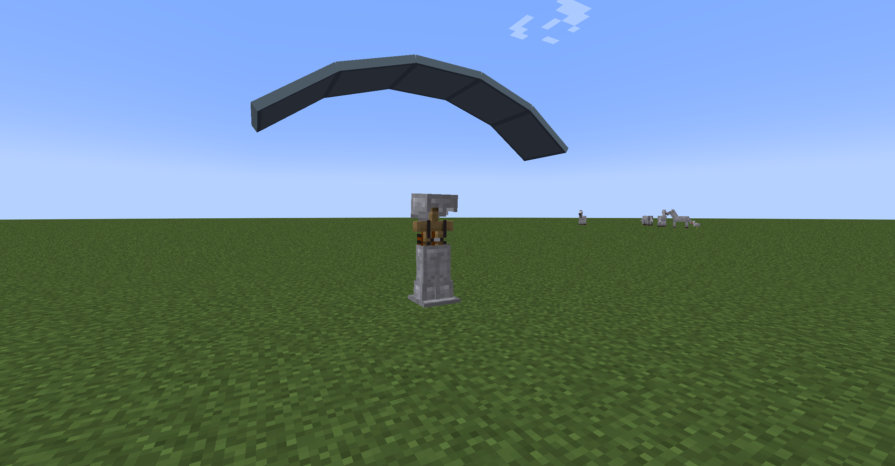

# 降落伞模组 说明文档

by Jaffe2718

## 配置

> ### 开发环境
> 
> #### 开发环境配置步骤
> 
> 1. 安装对应版本的JDK；
> 
> 2. 安装IDE；
> 
> 3. 克隆仓库代码 `git clone https://github.com/Jaffe2718/Fabric-Parachute-Mod-1.19.2-MDK.git`；
> 
> 4. 在IDE中加载Gradle任务（geckolib3的配置参数已经在`build.gradle`中配置完成，无需更改）。
> 
> #### 依赖项
> 
> | 项目        | 要求配置                    | 推荐配置                                       |
> | --------- | ----------------------- | ------------------------------------------ |
> | JDK       | >=17                    | Java(TM) SE Development Kit 17.0.6 (64bit) |
> | IDE       | JetBrains IntelliJ IDEA | Community / Ultimate                       |
> | geckolib3 | >=3.1.38                | geckolib-fabric-1.19:3.1.38                |
> 
> ### 客户端运行环境
> 
> #### 依赖项
> 
> | 项目                                                                                   | 要求配置                 | 推荐配置          | 描述                    |
> | ------------------------------------------------------------------------------------ | -------------------- | ------------- | --------------------- |
> | Minecraft                                                                            | 1.19.2 | 1.19.2        | 游戏核心                  |
> | 启动器                                                                                  | *                    | BakaXL Public | 游戏启动器                 |
> | Fabric Loader                                                                        | >=0.14.9             | 0.14.14       | Fabric 启动器            |
> | [Fabric API](https://modrinth.com/mod/fabric-apihttps://modrinth.com/mod/fabric-api) | *                    | 0.72.0+1.19.2 | Fabric API 作为该模组的前置模组 |
> | [Geckolib](https://modrinth.com/mod/geckolib)                                        | >=3.1.34 (不要安装4.x)   | 3.1.38        | Geckolib 作为该模组的前置模组   |

## 玩法说明

> ### 添加游戏元素
> 
> **降落伞** ：耐久100，可提供3点防御值，坠落时会使玩家缓速下降并免疫摔落伤害，降落伞打开一次会消耗1点耐久。
> 
> **空降奇兵**：合成降落伞即可解锁该成就。
> 
> ### 合成
> 
> 合成1个**降落伞**需要4个**幻翼膜**，2个**线**，1个**皮革**，具体合成方式如下：
> 
> 
> ### 使用方法
> 
> **降落伞**为可穿戴物品，穿戴占用胸甲槽位，可提供3点防御值，穿戴后在玩家摔落时可以减缓玩家的掉落速度并免疫摔落伤害。

## 效果展示

## 联系方式

[bilibili](https://space.bilibili.com/1671742926)

## 快速链接

[源码仓库](https://github.com/Jaffe2718/Fabric-Parachute-Mod-1.19.2-MDK)

[Fabric Wiki](https://fabricmc.net/wiki/doku.php)

[develop | Fabric (fabricmc.net)](https://fabricmc.net/develop/)

[Home · bernie-g/geckolib Wiki (github.com)](https://github.com/bernie-g/geckolib/wiki/)

[Geckolib - Minecraft Mod (modrinth.com)](https://modrinth.com/mod/geckolib)

[Fabric API - Minecraft Mod (modrinth.com)](https://modrinth.com/mod/fabric-api)
